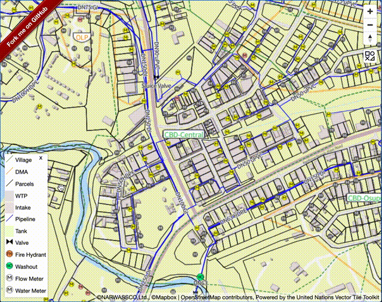

# mapbox-gl-legend


This module adds legend control which is able to create legend panel from mapbox style to mapbox-gl.

This module is using source code of [orangemug/legend-symbol](https://github.com/orangemug/legend-symbol). I just adopted this library to normal Mapbox GL Plugin. Thanks so much to develop this library!

## for Maplibre GL JS users

Please consider to use [maplibre-gl-legend](https://github.com/watergis/maplibre-gl-legend) for Maplibre GL JS.

## Installation:

```bash
npm i @watergis/mapbox-gl-legend --save
```

## Use CDN

```html
<link href='https://watergis.github.io/mapbox-gl-legend/mapbox-gl-legend.css' rel='stylesheet' />
<script src='https://api.mapbox.com/mapbox-gl-js/v1.13.1/mapbox-gl.js'></script>
<script src="https://watergis.github.io/mapbox-gl-legend/mapbox-gl-legend.js"></script>
<script>
map.on('load', function() {
    const targets = {
        'pipeline': 'Pipeline',
        'pipeline_annotation': 'Pipeline Label', 
        'meter': 'Water Meter',
        'flow meter': 'Flow Meter', 
        'valve': 'Valve', 
        'firehydrant': 'Fire Hydrant', 
        'washout': 'Washout',
        'tank': 'Tank', 
        'tank_annotation': 'Tank Label', 
        'wtp': 'WTP', 
        'wtp_annotation': 'WTP Label', 
        'intake': 'Intake', 
        'intake_annotation': 'Intake Label', 
        'parcels': 'Parcels', 
        'parcels_annotation': 'Parcels Label', 
        'village': 'Village', 
        'village_annotation': 'Village Label', 
        'dma': 'DMA',
        'dma-annotation': 'DMA Label', 
        'contour-line': 'Countour',
        'contour-label': 'Contour Label',
        'hillshade': 'Hillshade'
    };
    map.addControl(new MapboxLegendControl(targets, {
        showDefault: false, 
        showCheckbox: false, 
        onlyRendered: true,
        reverseOrder: true
    }), 'top-right');
})
</script>
```

Furthermore, you may download specific version's scripts and css locally from [release](https://github.com/watergis/mapbox-gl-export/releases) page.

## Demo:

Try [codesandbox](https://codesandbox.io/s/mapbox-gl-legend-0x6f0).

See [demo](https://watergis.github.io/mapbox-gl-legend/#12/-1.08551/35.87063).



## Test:

```
npm run build
npm start
```

open [http://localhost:8080](http://localhost:8080).

## Usage:

```ts
import { MapboxLegendControl } from "@watergis/mapbox-gl-legend";
import '@watergis/mapbox-gl-legend/css/styles.css';
import mapboxgl from 'mapbox-gl';

const map = new mapboxgl.Map();
//please add legend control after loading mapbox stylefiles, otherwise it causes errors...
map.on('load', function() {
const targets = {
  'pipeline': 'Pipeline',
  'pipeline_annotation': 'Pipeline Label', 
  'meter': 'Water Meter',
  'flow meter': 'Flow Meter', 
  'valve': 'Valve', 
  'firehydrant': 'Fire Hydrant', 
  'washout': 'Washout',
  'tank': 'Tank', 
  'tank_annotation': 'Tank Label', 
  'wtp': 'WTP', 
  'wtp_annotation': 'WTP Label', 
  'intake': 'Intake', 
  'intake_annotation': 'Intake Label', 
  'parcels': 'Parcels', 
  'parcels_annotation': 'Parcels Label', 
  'village': 'Village', 
  'village_annotation': 'Village Label', 
  'dma': 'DMA',
  'dma_annotation': 'DMA Label', 
};

// add legend control without checkbox, and it will be hide as default
map.addControl(new MapboxLegendControl(targets, {showDefault: false, showCheckbox: false, onlyRendered: false }), 'top-right');

// add legend control with checkbox, and it will be shown as default
map.addControl(new MapboxLegendControl(targets, {showDefault: true}), 'bottom-right');

// add legend control with all layers, and it reverse layer order
map.addControl(new MapboxLegendControl({}, {reverseOrder: false}), 'bottom-left');

// if you want to use basemap from Mapbox in v2
map.addControl(new MapboxLegendControl({}, {accesstoken: 'your mapbox accesstoken'}));

// if you want to customize the title of the legend
map.addControl(new MapboxLegendControl(targets, {title: 'Some Custom Title'}), 'top-right');
```

Specify your layers which you want to add the legend by the control.

### Options
- showDefault
  - true: Legend will be shown as default
  - false: Legend will be hide as default
  - default value is `true` if you don't specify the option.
- showCheckbox
  - true: the checkbox for switching visibility will be added as default
  - false: the checkbox will not be added as default
  - default value is `true` if you don't specify the option.
- reverseOrder
  - true: layers will be ordered from top. 
  - false: layers will be ordered from bottom. 
  - default value is `true` if you don't spefify the option.
- onlyRendered
  - true: only rendered layers will be shown on legend as default. 
  - false: all layers' legend will be shown as default. 
  - default value will be true.
- title
  - specify the title of the legend. 
  - default value is `Legend` if you don't specify the option.

## How to release

```zsh
npm version patch # it increase patch version 0.0.X
npm version minor # it increase minor version 0.x.0
npm version major # it increase major version x.0.0
git push origin master --tag
# release CI will create draft release in Github pages, then publish it if it is ready.
# publish CI will deploy npmjs and Github Packages.
```

## Contribution

This Mapbox GL Legend Control is still under experimental, so most welcome any feedbacks and pull request to this repository.
